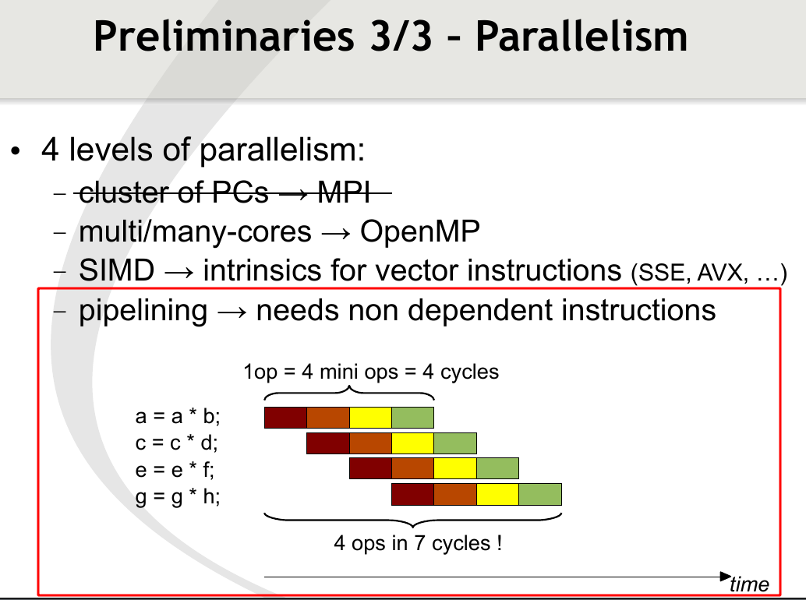

# C++ 工程化分享交流

## 1. 枚举值的设计

## 2. 值传递后移动

## 3. float vs double
float 代替 double 主要有两个好处：
1. float 字节数只有 double 的一般，因此可以节省内存并降低网络传输的带宽需求
2. 编译器会自动进行指令集加速，同一时间能进行的 float 计算数量是 double 的两倍
```
// 16384 floating value square, on Intel Xeon W-11855M (x86)
time cost of  float: 1.55343 us
time cost of double: 2.88714 us
```

但 float 有效精度远低于 double，使用时需注意数值归一化：比如一组数据的值域是 `[10000.0, 10001.0]`
- 如果用 double 表示，能有约15位有效数字，即10位小数精度
- 如果直接用 float 表示，只有约6位有效数字，即1位小数精度
- 如果把每个数减去10000再用 float 表示，则值域为 `[0.0, 1.0]`，有5位小数精度

## 4. CPU 流水线
CPU 使用不同的处理单元进行不同的数据操作（比如从内存取数据、数据相加、存数据到内存），对同一内存单元的不同操作只能串行执行，但对不同内存单元的不同操作可以自动并行！
  
https://downloads.tuxfamily.org/eigen/eigen_CGLibs_Giugno_Pisa_2013.pdf

计算图像灰度直方图的过程中，如果相邻像素值相同的概率很大（比如存在纯色背景或者图像内容简单），利用 CPU 流水线的处理方式加速效果非常显著:
```
unified value image ------------------------------------
  no pipelining: 5.7499 ms  result: 400000000.0000
with pipelining: 1.4345 ms  result: 400000000.0000
 random value image ------------------------------------
  no pipelining: 1.1518 ms  result: 397930441.0000
with pipelining: 1.0907 ms  result: 397930441.0000
```